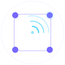
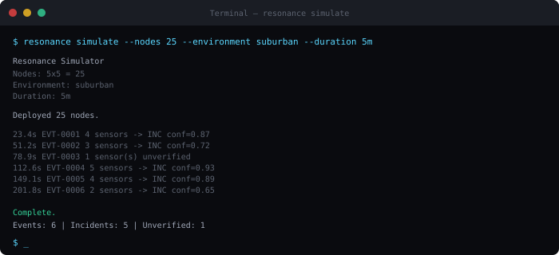
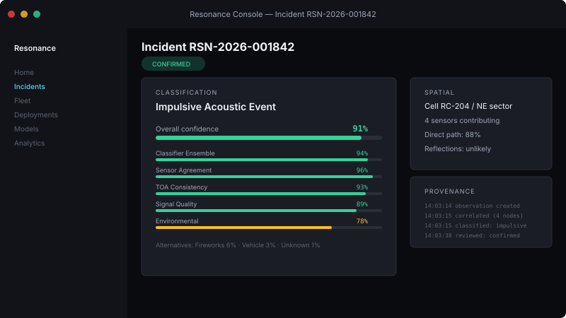

<p align="center">
  
</p>

<h1 align="center">Resonance</h1>

<p align="center"><strong>Spatial acoustic intelligence infrastructure.</strong></p>

<p align="center">
  <a href="LICENSE"></a>
  
  <a href="https://github.com/resonance-project/resonance/actions"></a>
  <a href="https://resonance-project.github.io/resonance"></a>
</p>

<p align="center">
  <em>An open software platform and reference architecture for distributed acoustic event detection.<br/>
  We build the framework. Hardware partners build the sensors.</em>
</p>

---

Resonance is an open platform for uncertainty-aware acoustic event detection. It replaces point-estimate "shot spotters" with probabilistic spatial inference over calibrated sensor arrays. Every detection produces a full confidence breakdown — not a pin on a map — and the architecture is designed so that speech recognition and continuous surveillance are structurally impossible.

## Architecture

```
┌─────────────┐     ┌──────────────┐     ┌───────────────┐     ┌──────────────────┐     ┌────────────────┐
│  Node R3    │────▶│ Spatial Cell  │────▶│   WaveGraph   │────▶│ Probability Field │────▶│ Evidence Fusion │
│ (edge DSP)  │     │ (4-8 nodes)  │     │ (propagation) │     │  (uncertainty)    │     │  (confidence)   │
└─────────────┘     └──────────────┘     └───────────────┘     └──────────────────┘     └────────────────┘
       │                    │                     │                       │                        │
   VectorWave DOA     Multi-node TDoA      Learned acoustic       Spatial probability      Calibrated
   feature extract    overlap geometry      path modeling          density estimates        output + audit
```

## Why Resonance

- **Probabilistic, not binary** — produces acoustic probability fields with explicit uncertainty instead of false-precision coordinates
- **Privacy by architecture** — raw audio never leaves the sensor; speech recognition is structurally impossible
- **Multi-node verification** — no single sensor can generate a high-confidence incident; requires spatial cell consensus
- **Learned propagation** — WaveGraph continuously models real acoustic behavior between nodes, adapting to terrain and environment
- **Explainable confidence** — every detection includes a full breakdown: classifier score, multi-node agreement, environmental model, and alternative hypotheses

## Reference Hardware

Resonance is a **software platform**. We do not manufacture hardware.

We publish open reference designs so that hardware partners, contract manufacturers, and research labs can build compatible sensor nodes. Three reference designs are specified at increasing complexity:

| Node | Purpose | Target manufacturer |
|------|---------|-------------------|
| RN-D1 | Development / education | DIY — off-the-shelf modules |
| RN-F1 (VectorNode X1) | Production field deployment | Contract electronics manufacturer |
| RN-P1 | Research / precision | Instrumentation company |

The VectorNode X1 design includes: 8-element MEMS array, precision pressure reference, ultrasonic wind sensor, GPS/PPS timing, environmental compensation, and edge DSP. All designs are published under CERN-OHL-P (permissive open hardware licence).

→ [Hardware reference designs](hardware/)  
→ [Manufacturing plan](hardware/MANUFACTURING_PLAN.md)  
→ [VectorNode X1 specification](specifications/RES-HW-VECTORNODE-X1.md)

## Quick Start

```bash
# Start the full stack
docker compose up -d

# Or build from source
cargo build --workspace --release

# Run the CLI
cargo run -p resonance-cli -- status

# Open the dashboard
open http://localhost:3400
```

## Simulation

```bash
# Run a 25-node suburban simulation
cargo run -p resonance-cli -- simulate \
  --nodes 25 \
  --environment suburban \
  --duration 300s

# Simulate specific scenarios
cargo run -p resonance-cli -- simulate \
  --scenario vehicle-backfire \
  --confidence-threshold 0.85
```

<p align="center">
  
  <br/>
  <em>Simulator creates virtual sensor networks for development without physical hardware.</em>
</p>

## What It Looks Like

<p align="center">
  
  <br/>
  <em>Every incident includes a full confidence breakdown with dimensional evidence scores.</em>
</p>

## Privacy by Architecture

Resonance is architecturally incapable of mass surveillance. The system processes only acoustic features extracted on-device — raw audio never traverses the network. The hardware and software are co-designed to make surveillance physically impossible, not merely policy-prohibited.

- **No speech recognition** — frequency bands and frame sizes are incompatible with speech decoding
- **No speaker identification** — no voiceprint extraction or biometric processing
- **No continuous streaming** — sensors transmit only impulsive-event feature vectors
- **No indefinite storage** — 3-second ring buffers auto-overwrite; no persistent audio archive
- **No tracking** — system detects acoustic events, not people

## Documentation

| Resource | Link |
|----------|------|
| Architecture overview | [docs site](https://resonance-project.github.io/resonance/technology/architecture) |
| Hardware specifications | [`specifications/hardware/`](specifications/hardware/) |
| Privacy model | [`PRIVACY.md`](PRIVACY.md) |
| API reference | [docs site](https://resonance-project.github.io/resonance/docs/) |
| Deployment guide | [docs site](https://resonance-project.github.io/resonance/docs/deployment) |

## Contributing

We welcome contributions. See [`CONTRIBUTING.md`](CONTRIBUTING.md) for development setup, coding standards, and PR guidelines.

## Roadmap

See [`CHANGELOG.md`](CHANGELOG.md) for release history and the [project board](https://github.com/resonance-project/resonance/projects) for planned work.

## Citation

```bibtex
@software{resonance2024,
  title     = {Resonance: Spatial Acoustic Intelligence Infrastructure},
  author    = {{Resonance Contributors}},
  year      = {2024},
  version   = {3.0.0},
  url       = {https://github.com/resonance-project/resonance},
  license   = {Apache-2.0}
}
```

## License

[Apache License 2.0](LICENSE) — free for commercial and non-commercial use.
